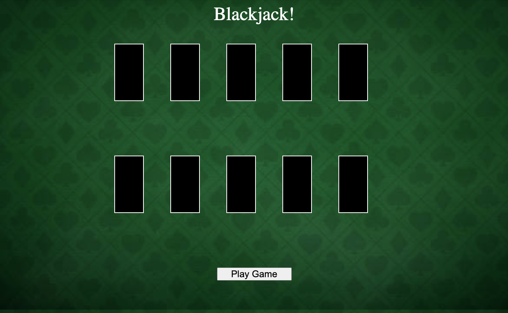
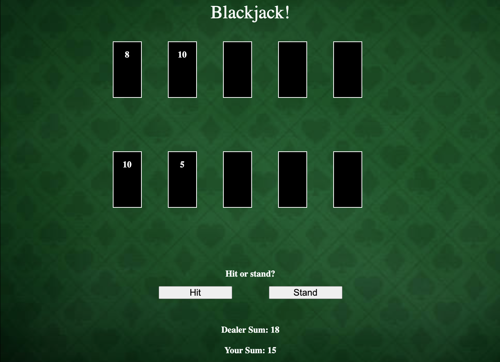
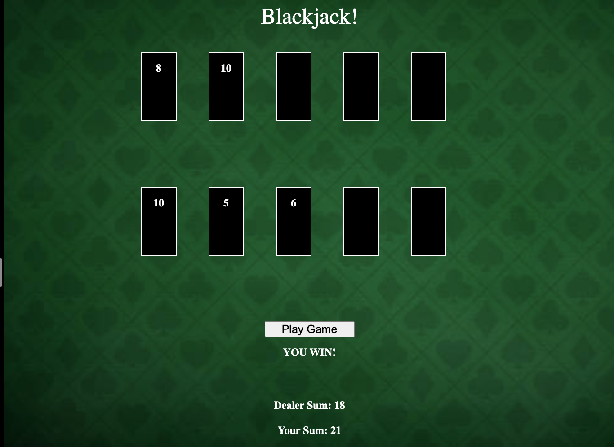

# Blackjack

## Date: 7/1/2022

### By: Avery Novick

#### [GitHub](https://github.com/anovick1) | [LinkedIn](https://www.linkedin.com/in/avery-novick-8651a7176/)

---

### **Description**

#### A simple blackjack game vs the computer.

---

### **Technologies Used**

- HTML
- CSS
- JavaScript

---

### **Getting Started**

After you (optionally fork and) clone this repo, open index.html and start playing!

Have Fun!

---

### **Screenshots**

##### Start Screen

##### Playing Screen

##### Final Screen

---

### **Task Lists**

- [ ] Card images + dealing animations
- [ ] Gambling
- [x] Simple working JS
- [x] Simple UI

---

### **Resources**

##### [Trello Link](https://trello.com/b/CD2kXIiL/project-1)

<!-- ##### Markdown Guide: [ia.net](https://ia.net/writer/support/general/markdown-guide)

##### Markdown Cheatsheet: [GitHub](https://guides.github.com/pdfs/markdown-cheatsheet-online.pdf) -->

---
