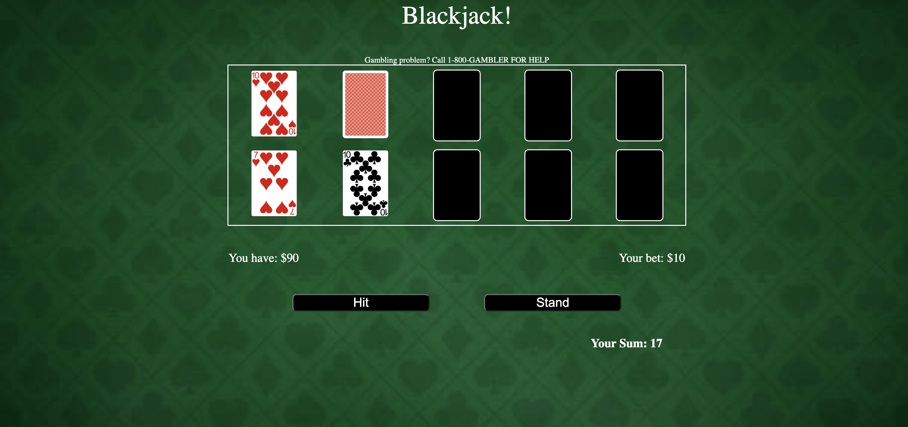

# Blackjack

## Date: 7/7/2022

### By: Avery Novick

####  

---

### **Description**

#### A simple blackjack game vs the computer.

---

### **Technologies Used**

- HTML
- CSS
- JavaScript

---

### **Getting Started**

After you (optionally fork and) clone this repo, open index.html and start playing!

Have Fun!

---

### **Screenshots**

##### Home Screen

##### Start Screen

##### Playing Screen

##### Final Screen

---

### **Task Lists**

- [ ] Enhanced UI
- [ ] Roulette mini-game for the casino
- [x] Simple working JS
- [x] Solid UI

---

### **Resources**

##### [Trello Link](https://trello.com/b/CD2kXIiL/project-1)

##### [Surge Deployment](https://averynovickblackjack.surge.sh/)

<!-- ##### Markdown Cheatsheet: [GitHub](https://guides.github.com/pdfs/markdown-cheatsheet-online.pdf) -->

---
